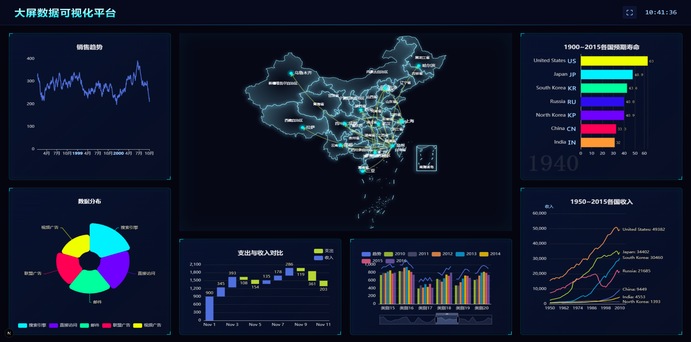

# 大屏数据可视化平台

> 基于 Next.js + ECharts 构建的科幻风格大屏数据可视化 Dashboard，支持中英文国际化，自适应任意屏幕分辨率。

---

## 预览

<!-- 在此处插入项目截图 -->



<!-- 在此处插入移动端/缩放效果截图 -->
<!--  -->

---

## 功能特性

- **科幻风格 UI**：深色背景、霓虹边框、发光面板，全套 Sci-Fi 视觉主题
- **自适应缩放**：以 1920×1080 为基准设计，自动等比缩放适配任意分辨率
- **中国地图**：基于 ECharts + GeoJSON 渲染交互式中国省份地图
- **多种图表类型**：
  - 动态折线图（实时滚动数据）
  - 折线竞速图（Line Race）
  - 动态柱状图（实时滚动数据）
  - 瀑布图（Waterfall Bar Chart）
  - 自定义柱状图
  - 饼图 / 环形图
  - 仪表盘（Gauge）
- **国际化（i18n）**：支持中文 / English 双语切换，基于 `next-intl`
- **实时时钟**：Header 内置实时时钟显示
- **全屏切换**：一键进入 / 退出全屏模式

---

## 技术栈

| 技术                                                             | 版本 | 说明                       |
| ---------------------------------------------------------------- | ---- | -------------------------- |
| [Next.js](https://nextjs.org/)                                   | ^16  | React 全栈框架，App Router |
| [React](https://react.dev/)                                      | ^19  | UI 框架                    |
| [TypeScript](https://www.typescriptlang.org/)                    | ^5   | 类型安全                   |
| [ECharts](https://echarts.apache.org/)                           | ^6   | 数据可视化图表库           |
| [echarts-for-react](https://github.com/hustcc/echarts-for-react) | ^3   | ECharts React 封装         |
| [Tailwind CSS](https://tailwindcss.com/)                         | ^4   | 原子化 CSS                 |
| [next-intl](https://next-intl-docs.vercel.app/)                  | ^4   | Next.js 国际化方案         |

---

## 项目结构

```
├── app/
│   ├── globals.css              # 全局样式 & Sci-Fi 主题变量
│   └── [locale]/
│       ├── layout.tsx           # 根布局（国际化 Provider）
│       └── page.tsx             # 主页面（Dashboard 布局）
├── components/
│   ├── BaseChart.tsx            # ECharts 基础封装组件
│   ├── CustomBarChart.tsx       # 自定义柱状图
│   ├── DynamicBarChart.tsx      # 动态柱状图 & 瀑布图
│   ├── DynamicLineChart.tsx     # 动态折线图 & 折线竞速图
│   ├── Header.tsx               # 顶部导航（标题 / 时钟 / 全屏）
│   ├── MapChart.tsx             # 中国地图组件
│   └── ScreenContainer.tsx      # 大屏自适应缩放容器
├── i18n/
│   └── request.ts               # next-intl 服务端配置
├── messages/
│   ├── zh.json                  # 中文翻译文案
│   └── en.json                  # 英文翻译文案
├── public/
│   ├── data/
│   │   ├── life-expectancy-table.json   # 1900~2015 各国预期寿命数据
│   │   └── emoji-flag-data.json         # 国旗 Emoji 数据
│   └── maps/
│       └── china.json                   # 中国地图 GeoJSON
├── utils/
│   ├── chartOptions.ts          # 各图表 ECharts option 配置
│   ├── chartExamples.ts         # 图表示例数据
│   └── translation.ts           # 翻译工具函数
├── middleware.ts                 # next-intl 路由中间件
├── next.config.js
├── tailwind.config.js
└── tsconfig.json
```

---

## 快速开始

### 环境要求

- Node.js >= 18
- pnpm >= 8（推荐）或 npm / yarn

### 安装依赖

```bash
pnpm install
```

### 启动开发服务器

```bash
pnpm dev
```

访问 [http://localhost:3000](http://localhost:3000)，会自动重定向到默认语言路由（`/zh`）。

### 构建生产版本

```bash
pnpm build
pnpm start
```

---

## 国际化

通过 URL 路径切换语言：

| 路径  | 语言         |
| ----- | ------------ |
| `/zh` | 中文（默认） |
| `/en` | English      |

翻译文案位于 `messages/zh.json` 和 `messages/en.json`，新增文案只需在两个文件中同步添加键值即可。

---

## 图表截图

<!-- 在此处插入各图表截图 -->

| 图表类型   | 预览                                                |
| ---------- | --------------------------------------------------- |
| 动态折线图 |  |
| 折线竞速图 |     |
| 动态柱状图 |   |
| 瀑布图     |         |
| 中国地图   |             |
| 饼图       |                 |
| 仪表盘     |             |

---

## 自适应原理

`ScreenContainer` 组件以 `1920×1080` 作为设计基准尺寸，监听 `window.resize` 事件，实时计算 X/Y 轴缩放比例并通过 CSS `transform: scale()` 等比缩放整个画布，保证在任意分辨率屏幕上呈现一致的视觉效果。

---

## 主题定制

Sci-Fi 主题色变量定义在 `app/globals.css` 的 `@theme` 块中：

```css
@theme {
  --color-scifi-bg: #050510; /* 背景色 */
  --color-scifi-panel: rgba(16, 20, 60, 0.4); /* 面板色 */
  --color-scifi-border: rgba(50, 80, 200, 0.3); /* 边框色 */
  --color-scifi-text: #a0d0ff; /* 文字色 */
  --color-scifi-highlight: #00f2ff; /* 高亮色（青色） */
  --color-scifi-secondary: #7000ff; /* 次要色（紫色） */
}
```

---

## License

MIT
